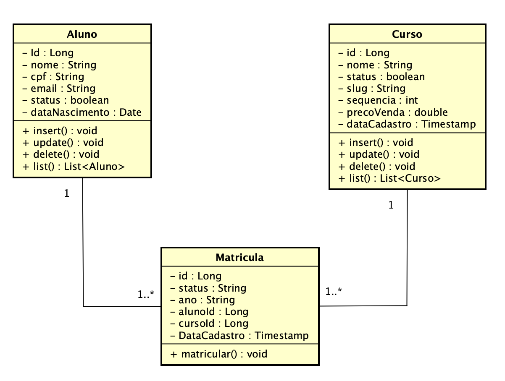
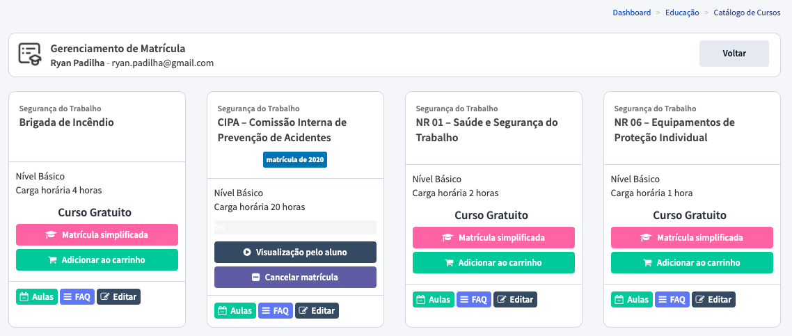

### Desafio desenvolvedor Full Stack Python

Seja bem-vindo(a) ao nosso desafio técnico!

Primeiramente agradecemos sua disponibilidade para o nosso desafio.
Como parte do processo seletivo, gostaríamos que resolvesse um desafio técnico, sendo este utilizado como ferramenta para que tenhamos uma noção clara do seu nível de conhecimento, e quais pontos devem ser trabalhados e fortalecidos, em caso de continuidade ao processo de seleção.

Durante o desenvolvimento de preferência a implementação usando [Python 3](https://www.python.org/), para acelerar o desenvolvimento web deve ser adotado o [Flask Framework](https://flask.palletsprojects.com/) e qualquer outra tecnologia que ache interessante para a solução proposta.
É válido ressaltar que pode ser utilizado um template pronto para desenvolvimento da parte visual da aplicação, como por exemplo o [AdminLTE 2](https://adminlte.io/themes/AdminLTE/index2.html).

O **objetivo é avaliar como será o desenvolvimento** do código-fonte em termos de:

1. Clareza e qualidade de código.
2. Arquitetura e organização do projeto.
3. Princípios e boas práticas de design e implementação.
4. Conhecimento em linguagem Python 3 em conjunto com o Flask Framework.

Observação:

- Foque de forma direta na resolução do problema, entretanto, entregue os requisitos levando em conta boas práticas de programação.
- Seria interessante a solução já estar pronta para execução.
- Utilize um mecanismo de persistência SQL como o PostgreSQL.
- **Bônus:** Deploy da aplicação em ambiente AWS.

Crie um projeto no Github para vermos os passos feitos através dos commits para resolver o desafio, descreve as instruções de uso através do README.md, caso acredite ser necessário.

Qualquer dúvida maior pode nos perguntar, mas no geral, divirta-se!

## ALCLaudius EdTech

**Contexto**

Sempre entendemos que a educação de qualidade é um direito de todos e que podemos ajudar o mundo através de nossa plataforma digital.

O ALClaudius EdTech nasceu da vontade crescente em inovar e otimizar a performance de aprendizado fortalecendo e ampliando o horizonte já existente da educação corporativa e venda de cursos online.

Um de nossos produtos é uma solução completa de EAD que traz para o ambiente digital de forma simples e intuitiva uma experiência de sala de aula próxima ao presencial, coletando detalhes do comportamento do aluno e seu engajamento com cada conteúdo apresentado, retratando métricas em tempo real do aprendizado.

**Necessidade de mercado**

Atualmente precisamos de uma plataforma web de matrícula simplificada do qual conta com a matrícula de determinado aluno na plataforma, representado pelo seguinte diagrama de classes:

 

| Aluno  | Curso  |  Matricula  |
|---|---|---|
| Id (identificar único) | Id (identificador único)  |  Id (identificador único)  |
| Nome | Nome  |  Status (matriculado, cancelado, bloqueado)  |
| CPF (deve ser único) | Status (ativo/inativo)  |  Ano  |
| E-mail (deve ser único) | Slug (nome do curso em formato de slug) |  Id do Aluno  |
| Status (ativo/inativo) | Sequência (exibição) |  Id do Curso  |
| Data de Nascimento | Preço de Venda |  Data/Hora de Cadastro |
|  | Data de Cadastro |   | 

Um curso possui várias matrículas de alunos, sendo que devemos primeiro realizar a persistência de um aluno e um curso e após realizar a matrícula do mesmo. Observe o exemplo pela imagem e seu descritivo respectivamente (apenas ilustrativo):

Figura 1 - Exemplo de matrícula de aluno e relação de cursos disponíveis.

Realize a modelagem de dados e a implementação do caso de uso proposto, do qual pode ser gradualmente desenvolvido:

1. Arquitetura da aplicação web e todos os mecanismos envolvidos para suportar o desenvolvimento.
2. Modalagem e persistência de dados.
3. Interface gráfica para inserir um aluno.
4. Interface gráfica para inserir um curso.
5. Interface gráfica para realizar a matrícula do aluno em determinado curso.
6. Exibição de relação de alunos matriculados em determinado curso.

**Maiores detalhes de regras de negócio**

1. Ao realizar o cadastro do aluno, verifique se o CPF já não existe na base, caso positivo exiba uma mensagem no formulário que o CPF já existe, o mesmo vale para o e-mail.
2. Ao realizar o cadastro do curso, gera um slug com base no nome, não sendo possível inserir slug duplicado, ou seja, cada curso deve possuir um slug único.
3. No processamento da matrícula devemos respeitar a regra que cada aluno é matriculado apenas uma vez em determinado curso, mas caso sua matrícula ativa seja cancelada, ele pode ser matriculado novamente no mesmo curso.

Mais uma vez, qualquer dúvida maior pode nos perguntar, boa sorte!

